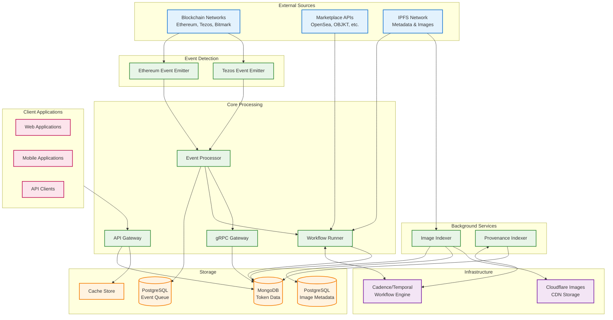

# System Architecture Diagram

This document provides a visual representation of the FF-Indexer system architecture, showing how all components interact and integrate with each other.

## System Architecture

## How It Works

The FF-Indexer system processes NFT data through several layers:

**External Sources**: Blockchain networks emit NFT events, while marketplace APIs and IPFS provide additional metadata and images.

**Event Detection**: Event emitters monitor blockchain networks and capture NFT events in real-time.

**Core Processing**: 
- **Event Processor** handles incoming events, stores them in PostgreSQL event queue, and triggers workflows
- **Workflow Runner** coordinates background indexing tasks using Cadence workflows
- **API Gateway** serves data directly to external clients
- **gRPC Gateway** handles internal service-to-service communication

**Background Services**: 
- **Provenance Indexer** tracks ownership history using Cadence workflows (different task list from Workflow Runner)
- **Image Indexer** operates independently (no Cadence), processes images from IPFS, stores metadata in PostgreSQL, and uploads to Cloudflare

**Storage**: 
- **MongoDB** stores main token-related data (tokens, assets, artists, sales)
- **PostgreSQL Event Queue** stores blockchain events for processing
- **PostgreSQL Image Metadata** stores image processing information
- **Cache Store** improves API performance

**Infrastructure**: 
- **Cadence/Temporal** manages workflow orchestration for Workflow Runner and Provenance Indexer
- **Cloudflare Images** provides CDN storage for processed images

**Client Applications**: Web applications, mobile apps, and API clients consume the indexed NFT data through the API Gateway.
